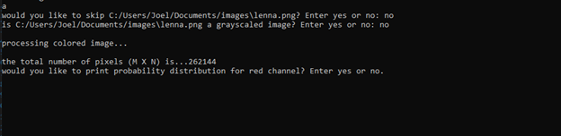
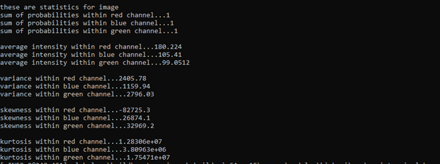

# Description

This software is written with the OpenCV library in C++. 
I am developing a digital image processing software that will allow me to analyze different images using a easy to use console interface.

# How to Run

To comple run the following command in the terminal.
  g++   -o   ./<name_of_executable>  ./assg_1_montano_J.cpp
  ./<name_of_executable>

you will not need any additional arguments.

First part of code will run through the following steps:
1.	You will be prompted for file path where images are located 
2.	You will be prompted whether there are subdirectories.
3.	You be prompted to choose a “operation for image.”

 

Second part of code will through the following steps:
1.	After choosing option a, you will be prompted if you’d like to skip image or not
2.	You will then be prompted if image is gray scaled or not 
3.	It will then process image and ask whether you’d like to print distribution
  *	If Image is colored it will ask 3 times for red, blue, green respectively
  *	Else it will ask for only gray scaled distribution.
 
 

 
Third part of code will print the following statistics and images broken down into their channels 
 

 
After exiting out of each image in current iteration it will repeat parts 1-3 until each image has been analyzed 

You do have the option to skip image and end the program like so 

# Upcoming goals

1. implement capability to visualize histograms for both gray scaled and colored images 
2. implement a variety of histogram operations on images such as histogram equalizaiton
3. implement both high-pass filtering and low-pass filtering 
4. implement geometric manipulation on images
